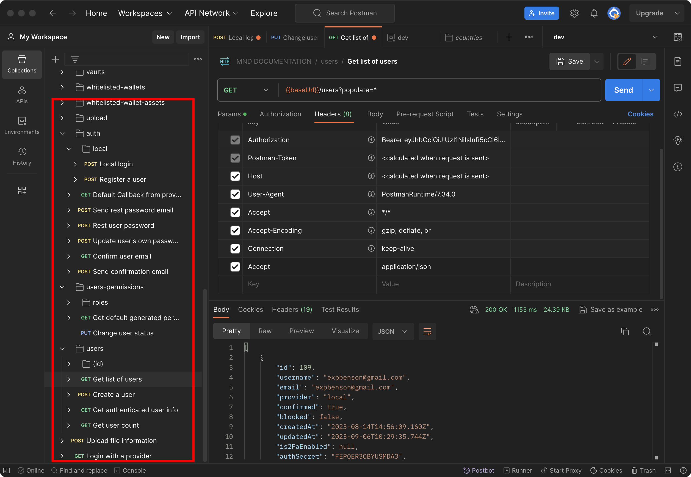
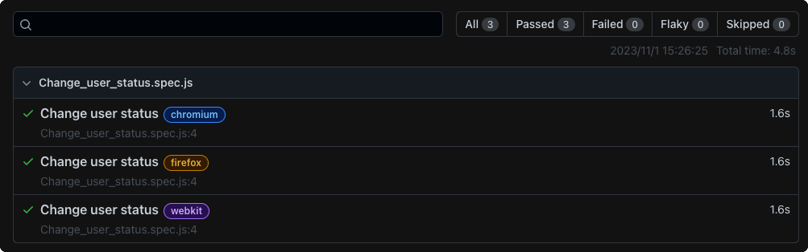

# Playwright

- [Playwright](#playwright)
  - [Install Dependencies](#install-dependencies)
  - [Test Scripts Write](#test-scripts-write)
    - [Public Variable](#public-variable)
    - [GET method](#get-method)
    - [POST method](#post-method)
    - [PUT method](#put-method)
    - [DELETE method](#delete-method)
  - [Test Command](#test-command)
  - [Test Reports](#test-reports)

Use playwright for API testing.

## Install Dependencies

```bash
npm install playwright
```

## Test Scripts Write

The test codes file should be put in `./tests` folder, like `Login_login.spec.js`, the name of the file should be the same to postman. As we already have a .json Configuration file for postman tests. Each test case corresponds to a test file.


### Public Variable

The Public variable should be saved in `./tests/shared.spec.js`, like baseURL, token, etc.

### GET method

GET method in javascript can be write like this.

```javascript
const { test, expect } = require("@playwright/test");
const { baseURL } = require("./shared.spec");

test("Get list of users", async ({ request }) => {
  const url = `${baseURL}/users?populate=*`;
  const response = await request.get(url);

  console.log(await response.json);
  expect(response.status()).toBe(200);
});
```

### POST method

POST method in javascript can be write like this.

```javascript
const { test, expect } = require("@playwright/test");
const { baseURL } = require("./shared.spec");

test("Local login", async ({ request }) => {
  const url = baseURL + "/auth/local";
  const response = await request.post(url, {
    data: {
      identifier: "name@mainnet.digital",
      password: "XXXX",
    },
    headers: {
      Accept: "application/json",
      "Content-Type": "application/json",
    },
  });

  const invalidJson = await response.json();
  const fixedJson = JSON.stringify(invalidJson);
  const data = JSON.parse(fixedJson);
  // console.log(data);
  const jwt = data.jwt;
  token = jwt;
  // console.log(jwt);
  expect(response.status()).toBe(200);
});
```

### PUT method

PUT method in javascript can be write like this.

```javascript
const { test, expect } = require("@playwright/test");
const { baseURL } = require("./shared.spec");

test("Change user status", async ({
  const invalidJson = await response.json();
  const fixedJson = JSON.stringify(invalidJson);
  const data = JSON.parse(fixedJson);
  // console.log(data);
  const token = data.jwt;
  // console.log(jwt);
  expect(response.status()).toBe(200);

  const url = url;
  const response2 = await request.put(url, {
    data: {
      action: "APPROVE",
    },
    headers: {
      Accept: "*/*",
      Authorization: "Bearer " + token,
    },
  });

  // console.log(await response.json);
  expect(response2.status()).toBe(200);
});
```

### DELETE method

No test for this part till now.

## Test Command

```bash
npx playwright test
  Runs the end-to-end tests.

npx playwright test --ui
  Starts the interactive UI mode.

npx playwright test --project=chromium
  Runs the tests only on Desktop Chrome.

npx playwright test example
  Runs the tests in a specific file.

npx playwright test --debug
  Runs the tests in debug mode.

npx playwright codegen
  Auto generate tests with Codegen.

We suggest that you begin by typing:
  npx playwright test
```

For this project, maybe this command is more convenient for each function module.

```bash
npx playwright test tests/[name of your script].js
```

## Test Reports

After your test completes, an HTML Reporter will be generated, which shows you a full report of your tests allowing you to filter the report by browsers, passed tests, failed tests, skipped tests and flaky tests. You can click on each test and explore the test's errors as well as each step of the test. By default, the HTML report is opened automatically if some of the tests failed.

```bash
npx playwright show-report
```


